# Oraculum - Enterprise Document Intelligence Platform

**AI-Powered Document Query System with Local LLM Processing & Multi-Tenant Architecture**

---

## 📊 Project Overview

| Feature | Implementation | Technology |
|---------|---------------|------------|
| **Document Formats** | 10+ formats | PDF, DOCX, XLSX, PPTX, CSV, TXT, MD |
| **Language Support** | 50+ languages | langdetect, ftfy (universal) |
| **AI Processing** | 100% local | GGUF models (TinyLlama to Llama 70B) |
| **Multi-Tenancy** | Hierarchical | Parent-child with permission inheritance |
| **Caching** | 3-layer | Query results, embeddings, chunks |
| **Test Coverage** | 70%+ | Unit, integration, E2E |

---

## 🏗️ System Architecture

```mermaid
graph TB
    subgraph "Client Layer"
        A1[Flutter Mobile<br/>iOS · Android]
        A2[Flutter Desktop<br/>Windows · macOS · Linux]
        A3[Flutter Web<br/>PWA]
    end
    
    subgraph "Gateway"
        B[Nginx<br/>TLS 1.3 · Load Balance]
    end
    
    subgraph "Application"
        C[FastAPI Backend<br/>Async · WebSocket]
        C1[Authentication]
        C2[Document Processor]
        C3[Embedding Service]
        C4[GGUF LLM]
        C5[Security Scanner]
    end
    
    subgraph "Data"
        D1[(PostgreSQL 15+<br/>Documents · Users)]
        D2[(Redis 6+<br/>Cache · Sessions)]
        D3[File Storage<br/>Tenant-Isolated]
        D4[HNSW Index<br/>Vector Search]
    end
    
    A1 & A2 & A3 --> B --> C
    C --> C1 & C2 & C3 & C4 & C5
    C2 --> D3
    C3 --> D4
    C --> D1 & D2
    
    style B fill:#009639,stroke:#006622,color:#fff
    style C fill:#009688,stroke:#00695C,color:#fff
    style C4 fill:#412991,stroke:#2D1A5F,color:#fff
    style D1 fill:#316192,stroke:#1E3A5F,color:#fff
    style D2 fill:#DC382D,stroke:#A02820,color:#fff
```

### Core Architecture Decisions

| Component | Technology | Rationale |
|-----------|-----------|-----------|
| **Backend** | FastAPI 0.104 + Python 3.12 | Async performance, auto OpenAPI docs, type safety with Pydantic 2.x |
| **Database** | PostgreSQL 15+ | JSONB for metadata, native arrays for embeddings, async support |
| **ORM** | SQLAlchemy 2.x + asyncpg | Async queries, type safety, 3x performance vs psycopg2 |
| **Cache** | Redis 6+ | Sub-millisecond latency, distributed rate limiting, session management |
| **AI/LLM** | GGUF (llama-cpp-python) | Local inference, no external APIs, CPU-only (no GPU required) |
| **Embeddings** | Sentence Transformers | High-quality semantic vectors, multi-language, batch processing |
| **Vector Search** | HNSW (hnswlib) | O(log N) search, 95%+ recall, in-memory for speed |
| **Frontend** | Flutter 3.0+ | Cross-platform (mobile/desktop/web), single codebase |
| **Proxy** | Nginx 1.24+ | TLS 1.3, HTTP/2, WebSocket proxying, load balancing |

---

## 🔄 RAG Architecture

### Document Processing Flow

### Query Processing Flow

---

## 🏢 Multi-Tenant Architecture

### Role-Based Access Control

| Role | Permissions | Use Case |
|------|-------------|----------|
| **Admin** | Create sub-tenants, invite users, upload/delete files, query, analytics | Tenant owner, department head |
| **Editor** | Upload/delete own files, query, analytics | Content manager, researcher |
| **Analyst** | Query, analytics, export reports | Data analyst, BI |
| **Viewer** | Query, view files | Read-only user, consultant |

**Key Principle**: Parent access grants child access. Child access does NOT grant parent access.

---

## 🛡️ Security Implementation

**Security Layers:**
- 🔐 **Authentication**: JWT with RS256 (1h access, 7d refresh)
- 🔒 **Encryption**: bcrypt passwords, AES-256 documents at rest
- 🛡️ **Headers**: CSP, HSTS, X-Frame-Options, X-Content-Type-Options
- ⚡ **Rate Limiting**: Redis-based sliding window (60 req/min per user)
- 👥 **RBAC**: Hierarchical permission inheritance
- 📝 **Audit Trail**: All queries and document access logged
- 🔍 **File Security**: Malware scanning, integrity validation, metadata stripping

---

## 📄 Document Processing Pipeline

### Intelligent Chunking Strategies

| Format | Strategy | Rationale |
|--------|----------|-----------|
| **PDF** | Page-aware sliding window (512 tokens, 128 overlap) | Preserves page boundaries for citations |
| **DOCX** | Paragraph-based semantic chunks | Maintains document structure |
| **Markdown** | Heading-based hierarchical chunks | Preserves section hierarchy |
| **CSV/Excel** | Row-based with column headers | Keeps tabular context |
| **PowerPoint** | Slide-based with speaker notes | Combines content + context |
| **Plain Text** | Sentence-aware sliding window | Avoids mid-sentence breaks |

---

## 🎯 Technical Highlights

### 1. Universal Language Processing

**Challenge**: Support 50+ languages without per-language configuration

**Solution**: 100% language-agnostic processing
- Automatic language detection (`langdetect`)
- Universal encoding correction (`ftfy`)
- Dynamic prompt generation
- Smart response sizing based on complexity

**Impact**: Single system handles all languages, zero configuration

### 2. Multi-Layer Caching

**Cache Strategy:**
- **Layer 1**: Query results (1h TTL)
- **Layer 2**: Embeddings (24h TTL)
- **Layer 3**: Chunks (6h TTL)

### 3. Content-Aware Chunking

**Traditional**: Fixed 512-character chunks (breaks context)

**Oraculum**: Format-specific strategies
- PDF: Page boundaries preserved
- DOCX: Paragraph-based
- CSV: Row-based with headers
- Markdown: Heading-based

### 4. Local LLM Inference

**Why Local**:
- Complete data sovereignty
- No external API calls
- Air-gapped deployment support
- Zero per-query costs

**Model Options**:
- **Dev**: TinyLlama 1.1B (~800MB)
- **Prod**: Mistral 7B (~4GB)
- **Advanced**: Llama 3.1 70B (~40GB)

---

## 🧪 Testing & Quality

```mermaid
graph LR
    A[Push] --> B[Pre-commit<br/>ruff · black]
    B --> C[CI]
    C --> D[Unit<br/>75%]
    D --> E[Integration<br/>65%]
    E --> F[Security<br/>bandit]
    F --> G[Build]
    
    style C fill:#2088FF,color:#fff
    style D fill:#4CAF50,color:#fff
    style E fill:#FF9800,color:#fff
```

| Test Type | Coverage | Tools | Time |
|-----------|----------|-------|------|
| **Unit** | 75% | pytest, pytest-asyncio | <30s |
| **Integration** | 65% | pytest + TestClient | <2min |
| **E2E** | Critical paths | pytest + full stack | <5min |
| **Load** | 100 concurrent | Locust | Variable |

**Quality Tools:**
- **Linting**: ruff
- **Formatting**: black, isort
- **Type Checking**: mypy
- **Security**: bandit, safety
- **Pre-commit**: Automated checks

---

## 📈 Performance Metrics

| Metric | Target | Implementation |
|--------|--------|----------------|
| **Async Architecture** | 100% | FastAPI + SQLAlchemy 2.x + asyncpg |
| **Caching** | Multi-layer | Redis (query, embedding, chunk) |
| **Vector Search** | Sub-100ms | HNSW in-memory index |
| **Connection Pool** | Optimized | 20 base, 30 overflow |
| **Background Tasks** | Non-blocking | Async document processing |

**Scalability Features:**
- 🔄 Stateless backend (horizontal scaling)
- 📊 Connection pooling (20 base, 30 overflow)
- ⚡ Redis distributed caching
- 🔀 Nginx load balancing
- 📦 Async background processing

---

## 🎓 Skills Demonstrated

### Backend Development
✅ Python 3.12 (async/await, type hints, dataclasses)  
✅ FastAPI (ASGI, dependency injection, middleware, WebSocket)  
✅ SQLAlchemy 2.x (async ORM, complex queries, migrations)  
✅ PostgreSQL (JSONB, arrays, full-text search, optimization)  
✅ Redis (caching, rate limiting, session management)  
✅ Security (JWT RS256, bcrypt, rate limiting, OWASP)

### AI/ML Engineering
✅ RAG Architecture (retrieval-augmented generation)  
✅ Local LLM (GGUF via llama-cpp-python)  
✅ Embeddings (Sentence Transformers, batch processing)  
✅ Vector Search (HNSW, approximate nearest neighbor)  
✅ NLP (language detection, encoding correction)  
✅ Optimization (caching, batch processing)

### Document Processing
✅ Multi-Format (PyPDF2, python-docx, openpyxl, python-pptx)  
✅ Text Extraction (encoding handling, metadata preservation)  
✅ Intelligent Chunking (content-aware strategies)  
✅ Error Handling (graceful fallbacks, format detection)

### DevOps & Infrastructure
✅ Database Migrations (Alembic)  
✅ Monitoring (Prometheus, OpenTelemetry, structured logging)  
✅ Testing (pytest, 70%+ coverage)  
✅ Code Quality (ruff, black, mypy, bandit)  
✅ Performance (async, pooling, optimization)

### Frontend Development
✅ Flutter (cross-platform: mobile, desktop, web)  
✅ State Management (Provider, reactive)  
✅ API Integration (REST, WebSocket)

### Software Engineering
✅ System Architecture (multi-tenant, microservices)  
✅ API Design (RESTful, versioning, OpenAPI)  
✅ Security (enterprise-grade auth/authz)  
✅ Performance (caching, async, optimization)  
✅ Testing (TDD, 70%+ coverage)

---

## 📊 Database Design

**Database Features:**
- **Multi-Tenancy**: Hierarchical with parent-child relationships
- **Async**: asyncpg driver with connection pooling
- **Indexes**: B-tree for queries, tenant_id filtering
- **JSONB**: Flexible metadata storage
- **Arrays**: Native embedding storage (no pgvector)

---

### 💡 Key Takeaway

**Built an enterprise document intelligence platform processing 10+ file formats across 50+ languages with 100% local LLM inference. Hierarchical multi-tenant architecture with content-aware chunking and multi-layer caching delivers production-ready performance.**

**Technologies**: Python 3.12 · FastAPI · PostgreSQL · Redis · Flutter · GGUF · Sentence Transformers · HNSW  
**Architecture**: Multi-Tenant · RAG · Async · Distributed Cache · Vector Search  
**Quality**: 70%+ Coverage · Type-Safe · Automated Linting · Security Scanning

