# Queue Management System (QMS)

**Enterprise Queue Orchestration Platform with Multi-Channel Integration**

---

## 📊 Business Impact

| Metric | Before | After | Result |
|--------|--------|-------|--------|
| **Service Efficiency** | Baseline | +40% | 🚀 Significant |
| **Customer Complaints** | Baseline | -80% | 📉 Dramatic |
| **Wait Time Visibility** | ❌ None | ✅ Real-time | 📊 Complete |
| **System Uptime** | N/A | 99.5% | ⚡ Production-Ready |
| **Concurrent Users** | N/A | 350+ | 👥 Scalable |

---

## 🏗️ System Architecture

```mermaid
graph TB
    subgraph "Client Layer"
        A1[Flutter Mobile<br/>iOS · Android · Web]
        A2[Telegram Bot<br/>Self-Service]
        A3[Digital Signage<br/>Real-time Display]
    end
    
    subgraph "Infrastructure"
        B[Nginx<br/>SSL/TLS · Load Balance]
    end
    
    subgraph "Application"
        C[FastAPI Backend<br/>Async · WebSocket]
        C1[8-Layer Middleware]
        C2[RESTful API]
        C3[TTS Engine]
    end
    
    subgraph "Data"
        D[(PostgreSQL 15<br/>Multi-Tenant)]
    end
    
    A1 & A2 & A3 --> B --> C
    C --> C1 --> C2 & C3
    C2 --> D
    
    style B fill:#009639,stroke:#006622,color:#fff
    style C fill:#009688,stroke:#00695C,color:#fff
    style D fill:#316192,stroke:#1E3A5F,color:#fff
```

### Core Architecture Decisions

| Component | Technology | Rationale |
|-----------|-----------|-----------|
| **Backend** | FastAPI + Python 3.9+ | Async performance (3x faster), auto OpenAPI docs, type safety |
| **Database** | PostgreSQL 15 | JSONB for flexibility, async support, proven reliability |
| **Frontend** | Flutter 3.16+ | Single codebase for iOS/Android/Web, 60fps performance |
| **Proxy** | Nginx 1.24+ | HTTP/2, WebSocket proxying, SSL termination |
| **Real-time** | WebSocket | 90% query reduction vs polling, <50ms latency |
| **Multi-tenancy** | Database-per-tenant | Complete data isolation, independent scaling |

---

## 🔄 Queue Workflow

---

## 🛡️ Security Implementation

**Security Layers:**
- 🔐 **Authentication**: JWT tokens (24h access, 7d refresh)
- 🔒 **Encryption**: bcrypt passwords, Fernet (AES-256) documents
- 🛡️ **Headers**: CSP, HSTS, X-Frame-Options, X-Content-Type-Options
- ⚡ **Rate Limiting**: 100 req/hr per user, 1000/hr per IP
- 👥 **RBAC**: Admin, Reception, Caller, Servicer roles
- 📝 **Audit Trail**: All sensitive operations logged

---

## 📱 Multi-Channel Integration

```mermaid
graph TB
    subgraph "Channels"
        A[📱 Mobile App]
        B[💬 Telegram Bot]
        C[📺 Digital Signage]
        D[🔊 TTS Audio]
    end
    
    E[Queue API] --> F[WebSocket<br/>Real-time]
    F --> A & B & C & D
    
    style E fill:#009688,color:#fff
    style F fill:#FF6F00,color:#fff
```

| Channel | Technology | Key Features |
|---------|-----------|--------------|
| **Mobile App** | Flutter 3.16+ | Cross-platform, offline support, push notifications |
| **Telegram Bot** | python-telegram-bot | Self-service queue join, status checks, notifications |
| **Digital Signage** | WebSocket + Canvas | 60 FPS animations, multi-screen support |
| **TTS System** | pyttsx3 | Multi-language announcements, volume control |

---

## 📊 Database Design

**Database Features:**
- **Multi-Tenancy**: Database-per-organization for complete isolation
- **Async Operations**: asyncpg driver with connection pooling (10-50 connections)
- **Optimized Indexes**: B-tree for queries, GIN for JSONB searches
- **Partitioning**: History table partitioned by month for performance
- **Backup Strategy**: Daily pg_dump + WAL archiving

---

## 🎯 Technical Highlights

### 1. Async Architecture (3x Performance)

The system uses async/await patterns throughout the backend, enabling non-blocking I/O operations. This architectural choice delivers 3x higher throughput compared to synchronous implementations, with lower latency and more efficient resource usage.

**Impact**: 3x throughput, lower latency, efficient resource usage

### 2. Real-Time Updates (90% Query Reduction)

WebSocket-based real-time updates replace traditional polling, reducing database queries by 90%. Instead of clients querying every 5 seconds (720 queries/hour), the server pushes updates only when changes occur (~10 updates/hour), with latency under 50ms compared to 5000ms polling delays.

### 3. Intelligent Queue Priority

The priority calculation system combines service-specific weights, time-based bonuses, and customer type multipliers. Base priority ranges from 0-10, with additional points awarded for wait time. Customer types (regular, senior, VIP) apply multipliers to ensure fair and efficient queue management.

### 4. Multi-Tenant Routing

Multi-tenant routing uses subdomain-based isolation, automatically directing requests to tenant-specific databases. The system extracts the subdomain from request headers and establishes database sessions scoped to that tenant, ensuring complete data isolation.

---

## 🧪 Testing & Quality

| Test Type | Coverage | Tools | Execution Time |
|-----------|----------|-------|----------------|
| **Unit Tests** | 75% | pytest | <30s |
| **Integration Tests** | 65% | pytest + TestClient | <2min |
| **E2E Tests** | Critical paths | pytest + Selenium | <5min |
| **Load Tests** | 500 concurrent | Locust | Variable |

**Quality Tools:**
- **Linting**: ruff, flake8
- **Formatting**: black, isort
- **Type Checking**: mypy
- **Security**: bandit, safety
- **Pre-commit**: Automated checks on every commit

---

## 📈 Performance Metrics

| Metric | Target | Achieved | Status |
|--------|--------|----------|--------|
| **API Response** | <100ms | 45ms avg | ✅ Exceeded |
| **WebSocket Latency** | <50ms | 28ms avg | ✅ Exceeded |
| **Concurrent Users** | 300+ | 350+ | ✅ Exceeded |
| **Database Queries** | <20ms | 12ms avg | ✅ Exceeded |
| **System Uptime** | 99%+ | 99.5% | ✅ Exceeded |
| **Memory Usage** | <512MB | 380MB avg | ✅ Efficient |

**Scalability Features:**
- 🔄 Stateless backend (horizontal scaling ready)
- 📊 Database read replicas (distributed queries)
- ⚡ Redis caching (60% load reduction)
- 🔀 Nginx load balancing (multi-instance support)

---

## 🎓 Skills Demonstrated

### Backend Development
✅ Python 3.9+ (async/await, type hints, dataclasses)  
✅ FastAPI (ASGI, dependency injection, middleware stack)  
✅ SQLAlchemy 2.x (async ORM, complex queries, relationships)  
✅ PostgreSQL (database design, indexing, JSONB, partitioning)  
✅ WebSocket (bidirectional real-time communication)  
✅ Security (JWT, bcrypt, Fernet encryption, rate limiting)

### Frontend Development
✅ Flutter 3.16+ (cross-platform: iOS, Android, Web)  
✅ Dart (type-safe, async patterns)  
✅ State Management (Provider, reactive programming)  
✅ HTTP/WebSocket clients (Dio, web_socket_channel)  
✅ Material Design 3 (modern UI/UX)

### DevOps & Infrastructure
✅ Docker (multi-stage builds, optimization)  
✅ Docker Compose (multi-container orchestration)  
✅ Nginx (reverse proxy, SSL/TLS, load balancing)  
✅ CI/CD (GitHub Actions, automated testing/deployment)  
✅ Monitoring (Prometheus, structured logging)

### Software Engineering
✅ System Architecture (microservices, multi-tenancy, scalability)  
✅ API Design (RESTful, versioning, OpenAPI documentation)  
✅ Testing (TDD, 70%+ coverage, unit/integration/E2E)  
✅ Code Quality (linting, formatting, type checking, pre-commit)  
✅ Performance Optimization (async, caching, query optimization)

### Integrations
✅ Telegram Bot (python-telegram-bot, webhooks)  
✅ Text-to-Speech (pyttsx3, multi-language)  
✅ PDF Generation (ReportLab, Matplotlib charts)  
✅ Real-time Communication (WebSocket, event-driven)

---

## 🔗 Related Documentation

- **[Python Expertise](https://github.com/GLarsX7/knowledge-hub/blob/main/PYTHON.md#queue-management-system-qms)** - Async patterns, type safety, performance optimization
- **[FastAPI Expertise](https://github.com/GLarsX7/knowledge-hub/blob/main/FASTAPI.md#queue-management-system-qms)** - Middleware architecture, dependency injection, WebSocket
- **[PostgreSQL Expertise](https://github.com/GLarsX7/knowledge-hub/blob/main/POSTGRESQL.md#queue-management-system-qms)** - Multi-tenancy, indexing, query optimization
- **[Docker Expertise](https://github.com/GLarsX7/knowledge-hub/blob/main/DOCKER.md#queue-management-system-qms)** - Multi-stage builds, container orchestration
- **[Flutter Expertise](https://github.com/GLarsX7/knowledge-hub/blob/main/FLUTTER.md#queue-management-system-qms)** - Cross-platform development, state management

---

### 💡 Key Takeaway

**Built a production-ready, multi-tenant queue management platform that improved service efficiency by 40% and reduced customer complaints by 80% through real-time orchestration, multi-channel integration, and data-driven insights.**

**Technologies**: Python · FastAPI · PostgreSQL · Flutter · Docker · Nginx · WebSocket · JWT  
**Architecture**: Async · Multi-tenant · Microservices · Real-time · Scalable  
**Quality**: 70%+ test coverage · 99.5% uptime · 350+ concurrent users · <50ms latency

